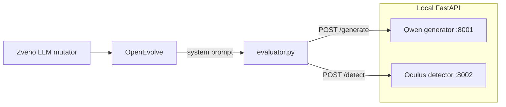

# Colab workflow

## Objective

Evolve a system prompt \(p\) for Qwen2.5-0.5B-Instruct so that Spanish essays on literary topics receive lower scores from the Oculus v2.0 detector.

For topic set \(\mathcal{T}\), one essay per topic:
\[
x_t = G(p, t), \quad t \in \mathcal{T}
\]

Detector logit \(f(x) \in \mathbb{R}\). Training fitness on \(|\mathcal{T}_{\mathrm{evo}}| = 250\) fixed topics:
\[
R(p) = -\frac{1}{|\mathcal{T}_{\mathrm{evo}}|} \sum_{t \in \mathcal{T}_{\mathrm{evo}}} f\bigl(G(p,t)\bigr)
\]

Full-dataset evaluation uses all $558$ topics with $K=5$ reps per topic from [pymlex/spanish-essay-topics](https://huggingface.co/datasets/pymlex/spanish-essay-topics).

## Architecture



Generator and detector stay resident in GPU memory. The evaluator only calls HTTP endpoints.

## Dependencies

```bash
pip install -r requirements.txt
```

## Environment files

Copy templates and set secrets:

```bash
cp env/generator.env.example env/generator.env
cp env/detector.env.example env/detector.env
cp env/evolution.env.example env/evolution.env
```

Set `OPENAI_API_KEY` in `env/evolution.env` for [ZvenoAI](https://api.zveno.ai/v1).

## Topic splits

Commands assume the current working directory is the repository root.

```bash
python scripts/prepare_topics.py
```

Writes `data/all_topics.json` and `data/eval_topics_250.json` with seed 42.

## Model servers

Run in separate terminals or background jobs:

```bash
python generator_api.py
python detector_api.py
```

## Baseline on full dataset

Set `EVAL_REPS_PER_TOPIC=5` in `env/evolution.env`.

```bash
python scripts/run_baseline_eval.py
```

Uses `initial_prompt.txt`. Artefacts under `results/baseline_full/`.

## Prompt evolution

```bash
python scripts/run_evolution.py
```

Each candidate prompt: 250 essays, batched generation and detection, fitness \(R(p)\). Island model: 5 islands, migration every 50 generations, rate 0.1. Mutations are small edits via the Zveno LLM template in `config/config_evolution.yaml`.

Best prompt: `results/experiment/best_prompt_evolved.txt`.

## Final evaluation

```bash
python scripts/run_final_eval.py
```

Evaluates the evolved prompt on all 558 topics. Artefacts under `results/final_full/`.

## Logit distributions and tests

```bash
python scripts/plot_logit_distributions.py
python scripts/analyze_eval_significance.py
```

Histogram: `results/logit_distribution_full.png`. Tests: `results/significance_tests.json`.
