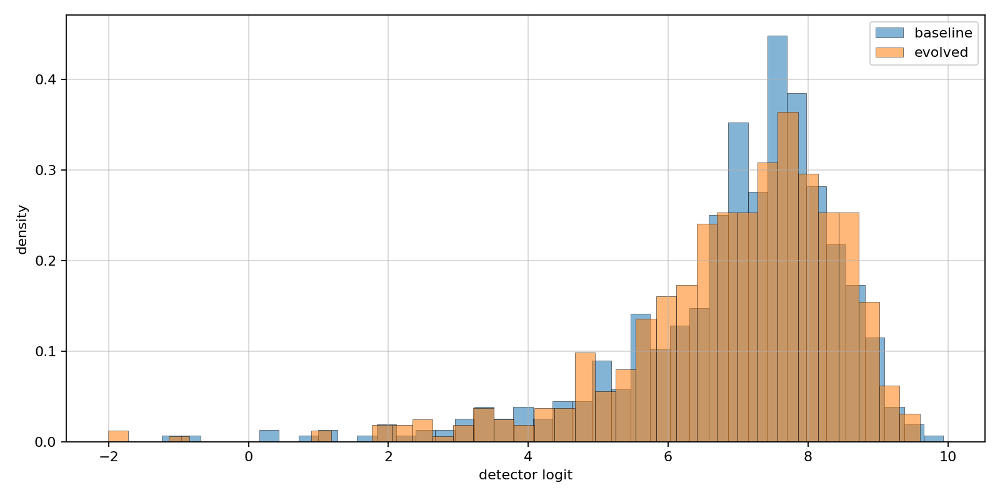
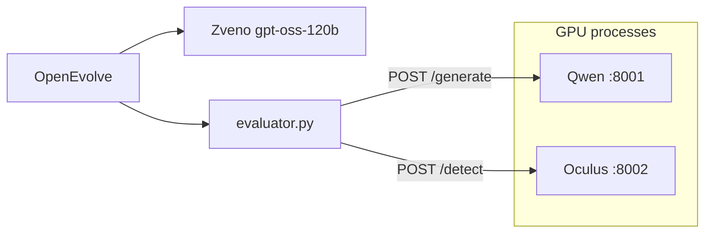

# Imitation Game

## Overview

We evolve a system prompt $p$ for [Qwen/Qwen2.5-0.5B-Instruct](https://huggingface.co/Qwen/Qwen2.5-0.5B-Instruct) so that generated Spanish essays on literary topics receive lower logits from [danibor/oculus-v2.0-multilingual](https://huggingface.co/danibor/oculus-v2.0-multilingual). Prompt mutations are proposed by [openai/gpt-oss-120b](https://api.zveno.ai/v1) through [OpenEvolve](https://github.com/algorithmicsuperintelligence/openevolve).

## Objective

For topic $t$ the generator produces one essay:

$$x_t = G(p, t)$$

The detector returns a scalar logit $f(x) \in \mathbb{R}$. Higher values correspond to stronger AI-generated classification after the sigmoid head. The fitness used in OpenEvolve is:

$$R(p) = -\frac{1}{N} \sum_{i=1}^{N} f(x_i)$$

During evolution $N = 250$ fixed topics from [pymlex/spanish-essay-topics](https://huggingface.co/datasets/pymlex/spanish-essay-topics). Baseline and final evaluation use all $558$ topics with $K = 5$ independent generations per topic, $558 \times K = 2790$ detector scores per stage.

## Experimental design

OpenEvolve starts from `prompts/initial_prompt.txt`, which explicitly asks the model not to write like an AI. That seed matches the first generation logged in `results/experiment/initial_prompt.txt`.

Full-corpus scoring uses a different control prompt, `prompts/evaluation_no_ai.txt`, without any anti-AI instruction. The baseline stage measures Qwen under neutral wording. The final stage applies the evolved prompt from `results/experiment/best_prompt_evolved.txt` under the same neutral evaluation protocol.

The question under test is whether prompt evolution shifts Oculus logits and human classification rate relative to that neutral baseline, not whether a hand-written “write like a human” line alone fools the detector.

## Stack

| Component | Model or tool | Role |
| --- | --- | --- |
| Generator API | Qwen2.5-0.5B-Instruct | Batched Spanish essays, greedy decoding, up to 300 new tokens |
| Detector API | Oculus v2.0 multilingual | Batched logits, max length 512 tokens |
| Mutator | openai/gpt-oss-120b via Zveno | Small edits to the system prompt |
| Search | OpenEvolve | Island model, MAP-Elites, tournament selection |

Typical hardware for a full run:

* GPU: NVIDIA GeForce RTX 5090
* OS: Ubuntu 24.04, Jupyter or plain SSH
* RAM: 64 GB

Both transformer checkpoints are held in VRAM inside the FastAPI workers. The evaluator only calls HTTP endpoints.

## Dataset

[pymlex/spanish-essay-topics](https://huggingface.co/datasets/pymlex/spanish-essay-topics) has 558 rows with a single field `topic`. Examples:

* El realismo mágico en Cien años de soledad
* La figura del héroe trágico en La vida es sueño

`scripts/prepare_topics.py` writes:

* `data/all_topics.json` — full list
* `data/eval_topics_250.json` — stratified random subset, seed 42

## Evolution setup

Settings live in `config/config_evolution.yaml`. The mutator is a reasoning model with a large token budget per call. `scripts/run_evolution.py` injects `OPENAI_API_KEY`, `OPENAI_API_BASE`, and `LLM_MODEL` from `env/evolution.env` into a runtime copy at `results/experiment/config_evolution_runtime.yaml`.

| Parameter | Value |
| --- | --- |
| `max_iterations` | 50 |
| `evolution.generations` | 50 |
| `database.population_size` | 200 |
| `evolution.elitism` | 20 |
| `database.archive_size` | 20 |
| `database.elite_selection_ratio` | 0.1 |
| `database.num_islands` | 2 |
| `database.migration_interval` | 50 |
| `database.migration_rate` | 0.1 |
| `GENERATOR_BATCH_SIZE` | 50 |
| `DETECTOR_BATCH_SIZE` | 125 |
| `llm.max_tokens` | 10000 |
| `max_code_length` | 10000 |
| Mutation policy | One local edit per step, Spanish prompt text only |
| Crossover probability | 0.3 |

Island status and per-step metrics are logged under `results/openevolve_output/logs/`. Step aggregates append to `results/evolution_metrics/eval_steps.jsonl`.

## Prerequisites

* Ubuntu with CUDA for PyTorch
* Python 3.10 or newer
* `git`
* Hugging Face access for Qwen and Oculus weights
* Zveno API key for prompt mutations
* Three free TCP ports on localhost: 8001 generator, 8002 detector

## Installation on a fresh machine

### 1. Clone and enter the repository

```bash
git clone https://github.com/pymlex/imitation-game.git
cd imitation-game
```

### 2. Python environment and dependencies

```bash
python3 -m venv .venv
source .venv/bin/activate
pip install -U pip
pip install -r requirements.txt
```

### 3. Environment files

The repository ships `env/generator.env`, `env/detector.env`, and `env/evolution.env` with defaults including `EVAL_REPS_PER_TOPIC=5`. After clone, set `OPENAI_API_KEY` in `env/evolution.env` only.

| File | Main variables |
| --- | --- |
| `env/generator.env` | `GENERATOR_MODEL_NAME`, `GENERATOR_PORT=8001`, `GENERATOR_BATCH_SIZE=50` |
| `env/detector.env` | `DETECTOR_MODEL_NAME`, `DETECTOR_PORT=8002`, `DETECTOR_BATCH_SIZE=125` |
| `env/evolution.env` | `OPENAI_API_KEY`, `EVAL_REPS_PER_TOPIC`, `EVOLUTION_INITIAL_PROMPT_PATH`, `EVAL_BASELINE_PROMPT_PATH` |

### 4. Topic splits

From the repository root:

```bash
python scripts/prepare_topics.py
```

### 5. Start model servers

Use two terminals with the virtual environment active.

```bash
source .venv/bin/activate
python generator_api.py
```

```bash
source .venv/bin/activate
python detector_api.py
```

Wait until both health checks respond on `http://127.0.0.1:8001/health` and `http://127.0.0.1:8002/health`.

## Evaluation pipeline

All commands below assume the repository root as the current working directory and both APIs running.

### Baseline on 558 topics, 5 reps each

Uses `prompts/evaluation_no_ai.txt` via `EVAL_BASELINE_PROMPT_PATH`.

```bash
python scripts/run_baseline_eval.py
```

Outputs under `results/baseline_full/`:

* `baseline_full_essays.csv` with columns `topic`, `rep`, `essay`, `logit`, `pred_human`
* `baseline_full_logits.json` with `n_samples = 2790`
* `baseline_full_metrics.json`

### Prompt evolution on 250 topics

Starts from `prompts/initial_prompt.txt`.

```bash
python scripts/run_evolution.py
```

Best prompt path: `results/experiment/best_prompt_evolved.txt`. Summary: `results/experiment/evolution_summary.json`.

### Final evaluation on 558 topics, 5 reps each

```bash
python scripts/run_final_eval.py
```

Outputs under `results/final_full/` with the same schema as baseline.

### Logit distributions and significance tests

```bash
python scripts/plot_logit_distributions.py
python scripts/analyze_eval_significance.py
```

The histogram uses all $2790$ logits per stage: `results/logit_distribution_full.png`.

Significance output: `results/significance_tests.json`

* Mann–Whitney $U$ on pooled logits, two-sided, no normality assumption
* $\chi^2$ test on the $2 \times 2$ table of human versus AI counts for baseline and evolved samples

## Results

Corpus evaluation on RTX 5090: `prompts/evaluation_no_ai.txt` versus `results/experiment/best_prompt_evolved.txt`, $558 \times 5 = 2790$ detector scores per stage. OpenEvolve on 250 topics reached $R = -6.642$ on the search set, 200 iterations in `results/experiment/evolution_summary.json`.

| Stage | $n$ | $\bar{\ell}$ | $\sigma$ | median | $n$ human | Human rate |
| --- | ---: | ---: | ---: | ---: | ---: | ---: |
| Evaluation baseline | 2790 | 6.939 | 1.600 | 7.315 | 10 | 0.36% |
| Evolved | 2790 | 6.941 | 1.625 | 7.277 | 15 | 0.54% |

$\Delta\bar{\ell} = +0.002$ between stages. The evolved prompt does not lower the mean logit on the full corpus under the neutral evaluation wording.

| Test | Statistic | $p$-value |
| --- | ---: | ---: |
| Mann–Whitney $U$ on logits | $U = 3.88 \times 10^6$ | 0.879 |
| $\chi^2$ on human vs AI counts | 0.643 | 0.423 |

Contingency table for classification, rows baseline then evolved, columns human then AI: $\begin{pmatrix} 10 & 2780 \\ 15 & 2775 \end{pmatrix}$. Neither test rejects the null of equal distributions at $\alpha = 0.05$.

## Analysis

**Generator capacity.** Qwen2.5-0.5B-Instruct is a small model. Greedy decoding with up to 300 new tokens yields repetitive academic Spanish. A long rubric in the evolved prompt mostly exceeds what 0.5B parameters can enforce in the surface text.

**Detector bias.** Logits concentrate between $4$ and $10$ with median near $7.3$. Only 25 of $5580$ pooled scores fall below the logit $0$ threshold. Oculus behaves as a near-saturated AI detector on this generator regardless of prompt family.

**Evolution versus neutral evaluation.** Search used `prompts/initial_prompt.txt` with an explicit anti-AI line. Corpus scoring deliberately removed that line so baseline and evolved prompts are compared on detector evasion, not on the effect of a single “write like a human” instruction. Under that design, evolution did not produce a statistically significant shift in logits or human rate on 2790 samples per arm.

**Interpretation.** The best prompt on 250 topics does not generalise to 558 topics with five stochastic repeats. Reported gains on the search set are within noise on the holdout corpus. A larger generator, domain calibration of Oculus, or decoding stochasticity are more plausible levers than further rubric growth in the system prompt.

## Logit distributions



Descriptive summary: `results/logit_distribution_summary.csv`.

## Prompts

**Evolution seed** (`prompts/initial_prompt.txt`):

```text
Escribe un ensayo académico breve en español sobre el tema indicado. Escribe como un ser humano, no como una IA.
```

**Evaluation baseline** (`prompts/evaluation_no_ai.txt`):

```text
Escribe un ensayo académico breve en español sobre el tema indicado.
```

**Evolved** (`results/experiment/best_prompt_evolved.txt`):

```text
# Ensayo breve (300‑500 palabras)
# Entrada: una línea con el tema.
# Salida: texto continuo sin metadatos.

Genera un ensayo en español que cumpla:

1. Extensión: 300‑500 palabras.
2. Estructura:
   - Introducción (1‑2 párrafos) con tesis clara.
   - Desarrollo (2‑3 párrafos) con al menos dos argumentos; cada argumento con ejemplo o dato breve.
   - Conclusión (1 párrafo) que sintetice y aporte reflexión.
3. Estilo formal, vocabulario preciso, conectores lógicos y matices subjetivos (“Resulta evidente que…”, “A mi juicio…”). No mencionar IA ni procesos de generación.
4. Cohesión: cada párrafo contiene una idea central y se enlaza con el anterior; tiempo verbal y persona consistentes.
5. Formato: párrafos separados por una línea en blanco, sin encabezados, listas ni viñetas.

Devuelve únicamente el ensayo generado, sin metadatos ni explicaciones adicionales.
```

## Project layout

```
imitation-game/
├── generator_api.py          # Qwen FastAPI service
├── detector_api.py           # Oculus FastAPI service
├── evaluator.py              # OpenEvolve fitness, 250 topics
├── pipeline_eval.py          # Full-corpus evaluation
├── config/
│   └── config_evolution.yaml
├── env/
│   ├── generator.env.example
│   ├── detector.env.example
│   └── evolution.env.example
├── prompts/
│   ├── initial_prompt.txt
│   └── evaluation_no_ai.txt
├── scripts/
│   ├── prepare_topics.py
│   ├── run_baseline_eval.py
│   ├── run_evolution.py
│   ├── run_final_eval.py
│   ├── plot_logit_distributions.py
│   └── analyze_eval_significance.py
├── data/                     # topics JSON after prepare_topics
└── results/                  # metrics, plots, evolved prompt
```

`python main.py` prints the ordered command list without running experiments.

## Architecture



## References

* Essay topics: https://huggingface.co/datasets/pymlex/spanish-essay-topics
* Generator: https://huggingface.co/Qwen/Qwen2.5-0.5B-Instruct
* Detector: https://huggingface.co/danibor/oculus-v2.0-multilingual
* OpenEvolve: https://github.com/algorithmicsuperintelligence/openevolve
* Zveno API: https://api.zveno.ai/v1
