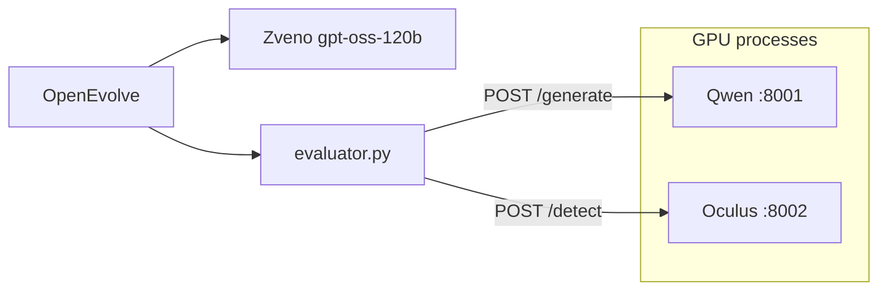

# Imitation Game

imitation-game: OpenEvolve system-prompt search for Qwen Spanish literary essays with batched Oculus detector scoring and Zveno reasoning LLM mutations.

## Overview

We evolve a system prompt $p$ for [Qwen/Qwen2.5-0.5B-Instruct](https://huggingface.co/Qwen/Qwen2.5-0.5B-Instruct) so that generated Spanish essays on literary topics receive lower logits from [danibor/oculus-v2.0-multilingual](https://huggingface.co/danibor/oculus-v2.0-multilingual). Prompt mutations are proposed by [openai/gpt-oss-120b](https://api.zveno.ai/v1) through [OpenEvolve](https://github.com/algorithmicsuperintelligence/openevolve).

## Objective

For topic $t$ the generator produces one essay:

$$x_t = G(p, t)$$

The detector returns a scalar logit $f(x) \in \mathbb{R}$. Higher values correspond to stronger AI-generated classification after the sigmoid head. The fitness used in OpenEvolve is:

$$R(p) = -\frac{1}{N} \sum_{i=1}^{N} f(x_i)$$

During evolution $N = 250$ fixed topics from [pymlex/spanish-essay-topics](https://huggingface.co/datasets/pymlex/spanish-essay-topics). Baseline and final evaluation use all $N = 558$ topics in the train split.

## Stack

| Component | Model or tool | Role |
| --- | --- | --- |
| Generator API | Qwen2.5-0.5B-Instruct | Batched Spanish essays, greedy decoding, up to 300 new tokens |
| Detector API | Oculus v2.0 multilingual | Batched logits, max length 512 tokens |
| Mutator | openai/gpt-oss-120b via Zveno | Small edits to the system prompt |
| Search | OpenEvolve | Island model, MAP-Elites, tournament selection |

Typical hardware for a full run:

* GPU: NVIDIA GeForce RTX 5090
* OS: Ubuntu 24.04, Jupyter or plain SSH
* RAM: 64 GB

Both transformer checkpoints are held in VRAM inside the FastAPI workers. The evaluator only calls HTTP endpoints.

## Dataset

[pymlex/spanish-essay-topics](https://huggingface.co/datasets/pymlex/spanish-essay-topics) has 558 rows with a single field `topic`. Examples:

* El realismo mágico en Cien años de soledad
* La figura del héroe trágico en La vida es sueño

`scripts/prepare_topics.py` writes:

* `data/all_topics.json` — full list
* `data/eval_topics_250.json` — stratified random subset, seed 42

## Evolution setup

Settings live in `config/config_evolution.yaml`. The mutator is a reasoning model with a large token budget per call. `scripts/run_evolution.py` injects `OPENAI_API_KEY`, `OPENAI_API_BASE`, and `LLM_MODEL` from `env/evolution.env` into a runtime copy at `results/experiment/config_evolution_runtime.yaml`.

| Parameter | Value |
| --- | --- |
| `max_iterations` | 50 |
| `evolution.generations` | 50 |
| `database.population_size` | 200 |
| `evolution.elitism` | 20 |
| `database.archive_size` | 20 |
| `database.elite_selection_ratio` | 0.1 |
| `database.num_islands` | 2 |
| `database.migration_interval` | 50 |
| `database.migration_rate` | 0.1 |
| `GENERATOR_BATCH_SIZE` | 50 |
| `DETECTOR_BATCH_SIZE` | 125 |
| `llm.max_tokens` | 10000 |
| `max_code_length` | 10000 |
| Mutation policy | One local edit per step, Spanish prompt text only |
| Crossover probability | 0.3 |

Island status and per-step metrics are logged under `results/openevolve_output/logs/`. Step aggregates append to `results/evolution_metrics/eval_steps.jsonl`.

## Prerequisites

* Ubuntu with CUDA for PyTorch
* Python 3.10 or newer
* `git`
* Hugging Face access for Qwen and Oculus weights
* Zveno API key for prompt mutations
* Three free TCP ports on localhost: 8001 generator, 8002 detector

## Installation on a fresh machine

### 1. Clone and enter the repository

```bash
git clone https://github.com/pymlex/imitation-game.git
cd imitation-game
```

### 2. Python environment and dependencies

```bash
python3 -m venv .venv
source .venv/bin/activate
pip install -U pip
pip install -r requirements.txt
```

### 3. Environment files

```bash
cp env/generator.env.example env/generator.env
cp env/detector.env.example env/detector.env
cp env/evolution.env.example env/evolution.env
```

Edit `env/evolution.env` and set `OPENAI_API_KEY`. Do not commit `env/*.env`. Templates `*.env.example` stay in the repository.

| File | Main variables |
| --- | --- |
| `env/generator.env` | `GENERATOR_MODEL_NAME`, `GENERATOR_PORT=8001`, `GENERATOR_BATCH_SIZE` |
| `env/detector.env` | `DETECTOR_MODEL_NAME`, `DETECTOR_PORT=8002`, `DETECTOR_BATCH_SIZE` |
| `env/evolution.env` | `OPENAI_API_KEY`, `GENERATOR_API_URL`, `DETECTOR_API_URL`, paths under `data/` and `results/` |

### 4. Topic splits

From the repository root:

```bash
python scripts/prepare_topics.py
```

### 5. Start model servers

Use two terminals with the virtual environment active.

```bash
source .venv/bin/activate
python generator_api.py
```

```bash
source .venv/bin/activate
python detector_api.py
```

Wait until both health checks respond on `http://127.0.0.1:8001/health` and `http://127.0.0.1:8002/health`.

## Evaluation pipeline

All commands below assume the repository root as the current working directory and both APIs running.

### Baseline on 558 topics

Uses `initial_prompt.txt`:

```bash
python scripts/run_baseline_eval.py
```

Outputs under `results/baseline_full/`:

* `baseline_full_essays.csv`
* `baseline_full_logits.json`
* `baseline_full_metrics.json`

### Prompt evolution on 250 topics

```bash
python scripts/run_evolution.py
```

Best prompt path: `results/experiment/best_prompt_evolved.txt`. Summary: `results/experiment/evolution_summary.json`.

### Final evaluation on 558 topics

```bash
python scripts/run_final_eval.py
```

Outputs under `results/final_full/` with the same naming pattern as the baseline stage.

### Logit distributions

```bash
python scripts/plot_logit_distributions.py
```

Writes `results/logit_distribution_full.png` and `results/logit_distribution_summary.csv`. Baseline and evolved histograms share the same axes.

## Results

Full-corpus evaluation on RTX 5090 after OpenEvolve with `openai/gpt-oss-120b` mutations. Evolution log: `results/experiment/evolution_summary.json`, best fitness on 250 topics $R = -6.642$ at $\bar{\ell} = 6.642$, 125 evaluator calls, 200 iterations in the logged run in `results/evolution_metrics/eval_steps.jsonl`.

| Stage | Topics | $\bar{\ell}$ | $\sigma$ | median | $R=-\bar{\ell}$ | Predicted human |
| --- | ---: | ---: | ---: | ---: | ---: | ---: |
| Baseline | 558 | 6.982 | 1.519 | 7.257 | −6.982 | 1 / 558 |
| Evolved | 558 | 6.916 | 1.617 | 7.268 | −6.916 | 3 / 558 |

Relative change of mean logit: $\Delta\bar{\ell} = -0.066$, about $0.95\%$ below baseline. Paired comparison on the same topic order: 279 topics improved, 279 worsened, exact balance on the mean shift.

Detector rule: logit $\geq 0$ maps to AI. With $\bar{\ell} \approx 7$ the sigmoid probability is essentially saturated:

$$P(\text{AI}\mid x) = \sigma(f(x)) \approx \sigma(7) \approx 0.999$$

## Analysis

**Generator capacity.** Qwen2.5-0.5B-Instruct is a small instruction model. It has limited lexical and rhetorical range compared with the mutator and with the DeBERTa-large backbone inside Oculus. Essays stay short, template-like, and syntactically regular under greedy decoding. Style instructions in the system prompt only partially surface in the text because the weights underfit rich constraints.

**Detector bias.** Oculus was trained to flag machine-generated prose. Logits cluster between $4$ and $10$ with a mode near $7$. The histogram shows almost no mass below $0$. The classifier behaves as a near-certain AI detector on Qwen outputs regardless of prompt wording. Shifting $\bar{\ell}$ by $0.07$ nudges the density slightly left but does not move the bulk of the distribution across the decision boundary.

**Evolution versus holdout.** Search on 250 topics found prompts with $\bar{\ell}$ down to about $6.625$ in individual evaluations and $6.642$ for the archived best prompt. Transfer to all 558 topics gives $\bar{\ell} = 6.916$, closer to the baseline full-corpus mean. The mutator expanded the prompt into a long rubric with numbered sections. That structure is typical of LLM-authored instructions and may not compress into reliable behaviour in a 0.5B generator.

**Interpretation.** Prompt evolution under this stack is a weak lever. Gains are measurable in the mean but not in the classification rate. Three essays fall below the threshold after evolution against one at baseline. Further movement likely needs a larger generator, detector calibration on in-domain student writing, or decoding noise rather than prompt text alone.

## Logit distributions

Baseline and evolved densities on the same axes:


Summary statistics: `results/logit_distribution_summary.csv`.

## Prompts

**Baseline** (`initial_prompt.txt`):

```text
Escribe un ensayo académico breve en español sobre el tema indicado. Escribe como un ser humano, no como una IA.
```

**Evolved** (`results/experiment/best_prompt_evolved.txt`):

```text
# Ensayo breve (300‑500 palabras)
# Entrada: una línea con el tema.
# Salida: texto continuo sin metadatos.

Genera un ensayo en español que cumpla:

1. Extensión: 300‑500 palabras.
2. Estructura:
   - Introducción (1‑2 párrafos) con tesis clara.
   - Desarrollo (2‑3 párrafos) con al menos dos argumentos; cada argumento con ejemplo o dato breve.
   - Conclusión (1 párrafo) que sintetice y aporte reflexión.
3. Estilo formal, vocabulario preciso, conectores lógicos y matices subjetivos (“Resulta evidente que…”, “A mi juicio…”). No mencionar IA ni procesos de generación.
4. Cohesión: cada párrafo contiene una idea central y se enlaza con el anterior; tiempo verbal y persona consistentes.
5. Formato: párrafos separados por una línea en blanco, sin encabezados, listas ni viñetas.

Devuelve únicamente el ensayo generado, sin metadatos ni explicaciones adicionales.
```

## Project layout

```
imitation-game/
├── generator_api.py          # Qwen FastAPI service
├── detector_api.py           # Oculus FastAPI service
├── evaluator.py              # OpenEvolve fitness, 250 topics
├── pipeline_eval.py          # Full-corpus evaluation
├── config/
│   └── config_evolution.yaml
├── env/
│   ├── generator.env.example
│   ├── detector.env.example
│   └── evolution.env.example
├── initial_prompt.txt
├── scripts/
│   ├── prepare_topics.py
│   ├── run_baseline_eval.py
│   ├── run_evolution.py
│   ├── run_final_eval.py
│   └── plot_logit_distributions.py
├── data/                     # topics JSON after prepare_topics
└── results/                  # metrics, plots, evolved prompt
```

`python main.py` prints the ordered command list without running experiments.

## Architecture



## References

* Essay topics: https://huggingface.co/datasets/pymlex/spanish-essay-topics
* Generator: https://huggingface.co/Qwen/Qwen2.5-0.5B-Instruct
* Detector: https://huggingface.co/danibor/oculus-v2.0-multilingual
* OpenEvolve: https://github.com/algorithmicsuperintelligence/openevolve
* Zveno API: https://api.zveno.ai/v1
